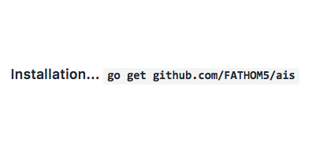

[](http://godoc.org/github.com/FATHOM5/ais)
[](https://travis-ci.org/FATHOM5/ais)
<p align="center">
  
 
  
</p>

#### Jump straight to [Usage](README.md#usage)

# Package AIS - *Beta Release*
In September 2018 the United States Navy hosted the annual [HACKtheMACHINE](https://hackthemachine.ai) Navy Digital Experience in Seattle, Washington. The three-day prototyping, public engagment and educational experience is designed to generated insights into maritime cybersecurity, data science, and rapid prototyping. Track 2, the data science track, focused on collision avoidance between ships.  

The U.S. Navy is the largest international operator of unmanned and autonomous systems sailing on and under the world's oceans. Developing algorithms that contribute to safe navigation by autonomous and manned vessels is in the best interest of the Navy and the public. To support the development of such AI-driven navigational systems the Navy sponsored HACKtheMACHINE Seattle Track 2 to create collision avoidance training data from publicly available maritime shipping data.  Read the full challenge description [here](https://github.com/FATHOM5/Seattle_Track_2).

This repository is a Go language package, open-source release, of a software toolkit built from insights gained during HACKtheMACHINE Seattle. Over the course of the multi-day challenge teams tried several approaches using a variety of software languages and geospatial information systems (GIS).  Ultimately, the complexity of the challenge prevented any single team from providing a complete solution, but all of the winners (see acknowledgements below) provided some useful ideas that are captured in this package. The decision by the Navy to open source release the prototype data science tools built on the ideas generated at HACKtheMACHINE is meant to continue building a vibrant community of practice for maritime data science hobbyists and professionals.  **Please use this code, submit issues to improve it, and join in.  Our community is organized here and on [LinkedIn](https://www.linkedin.com/groups/12145028/). Please reach out with questions about the code, suggestions to make the usage documentation better, maritime data science in general, or just to ask a few questions about the community.** 

## What's in the package?
*Package `FATHOM5/ais` contains tools for creating machine learning datasets for navigation systems based on open data released by the U.S. Government.*

The largest and most comprehensive public data source for maritime domain awareness is the Automatic Identification System (AIS) data collected and released to the public by the U.S. Government on the [marinecadastre.gov](https://marinecadastre.gov/ais/) website.  These comma separated value (csv) data files average more than 25,000,000 records per file, and a single month of data is a set of 20 files totalling over 60Gb of information.  Therefore, the first hurdle to building a machine learning dataset from these files is a big-data challenge to find interesting interactions in this large corpus of records.

The `ais` package contains tools for abstracting the process of opening, reading and manipulating these large files and additional tools that support algorithm development to identify interesting interactions. The primary goal of `ais` is to provide high performance abstractions for dealing with large AIS datasets.  In this Beta release, high performance means processing a full day of data for identifying potential two-ship interactions in about 17 seconds.  We know this can be improved upon and are eager to get the Beta into use within the community to make it better. Note that 17s performance is inspired by ideas from HACKtheMACHINE but far exceeds any approach demonstrated at the competition by several orders of magnitude. 

## Installation
Package `FATHOM5/ais` is a standard Go language library installed in the typical fashion.

    go get github.com/FATHOM5/ais
    
Include the package in your code with

    include "github.com/FATHOM5/ais"

## Usage
The package contains many facilities for abstracting the use of large AIS csv files, creating subsets of those files, sorting large AIS datasets, appending data to records, and implementing time convolution algorithms. This usage guide introduces many of these ideas with more detailed guidelines available in the [godocs](https://godoc.org/github.com/FATHOM5/ais).

   [Basic Operations on RecordSets](README.md#basic-operations-on-recordsets)  
   [Basic Operations on Records](README.md#basic-operations-on-records)  
   [Subsets](README.md#subsets)  
   [Sorting](README.md#sorting)  
   [Appending Fields to Records](README.md#appending-fields-to-records)  
   [Convolution Algorithms](README.md#convolution-algorithms)  
   
### Basic Operations on RecordSets
The first requirement of the package is to reduce the complexities of working with large CSV files and allow algorithm developers to focus on the type `RecordSet` which is an abstraction to the on-disk CSV files.

```
OpenRecordSet(filename string) (*RecordSet, error)
func (rs *RecordSet) Save(filename string) error
```
The facilities `OpenRecordSet` and `Save` allow users to open a CSV file downloaded from [marinecadastre.gov](https://marinecadastre.gov/ais/) into a `RecordSet`, and to save a `RecordSet` to disk after completing other operations.  Since the `RecordSet` often manages a `*os.File` object that requires closing, it is a best practice to call `defer rs.Close()` right after opening a `RecordSet`. 

The typical workflow is to open a `RecordSet` from disk, analyze the data using other tools in the package, then save the modified set back to disk. 

```go
rs, err := ais.OpenRecordSet("data.csv")
defer rs.Close()
if err != nil {
    panic(err)
}

// analyze the recordset...

err = rs.Save("result.csv")
if err != nil {
    panic(err)
}
```
To create an empty `RecordSet` the package provides 

```
NewRecordSet() *RecordSet
```
The `*RecordSet` returned from this function maintains its data in memory until the `Save` function is called to write the set to disk.

A `RecordSet` is comprised of two parts.  First, there is a `Headers` object derived from the first row of CSV data in the file that was opened. The set of `Headers` can be associated with a JSON `Dictionary` that provides `Definitions` for all of the data fields.  For any production use the data `Dictionary` should be considered a mandatory addition to the project, but is often omitted in early data analysis work.  The `Dictionary` should be a JSON file with multiple `ais.Definition` objects serialized into the file.  Loading and assigning the dictionary is demonstrated in this code snippet.

```go
// Most error handling omitted for brevity, but should definitely be 
// included in package use.
rs, _ := ais.OpenRecordSet("data.csv")
defer rs.Close()
j, _ = os.Open("dataDictionary.json")
defer j.Close()
jsonBlob, _ := ioutil.ReadAll(j)
if err := rs.SetDictionary(jsonBlob); err != nil {
	panic(err)
}

h := rs.Headers()
fmt.Println(h)
```
The final call to `fmt.Println(h)` will call the `Stringer` interface for `Headers` and pretty print the index, header name, and definition for all of the column names contained in the underlying csv file that `rs` now accesses.

Second, in addition to `Headers` the `RecordSet` contains an unexported data store of the AIS reports in the set.  Each line of data in the underlying CSV files is a single `Record` that can be accessed through calls to the `Read()` method.  Each call to `Read()` advances the file pointer in the underlying CSV file until reaching `io.EOF`.  The idiomatic way to process through each `Record` in the `RecordSet` is

```go
// Some error handling omitted for brevity, but should definitely be 
// included in package use.
rs, err := ais.OpenRecordSet("data.csv")
defer rs.Close()
if err != nil {
    panic(err)
}

var rec *ais.Record
for {
	rec, err := rs.Read()
	if err == io.EOF {
		break
	}
	if err != nil {
		panic(err)
	}

    // Do something with rec
}
```

A `RecordSet` also supports `Write(rec Record) error` calls.  This allows users to create new `RecordSet` objects. As previously stated, high performance is an important goal of the package and therefore slow IO operations to disk are minimized through buffering.  So after completing a series of `Write(...)` operations package users must call `Flush()` to flush out any remaining contents of the buffer.

```go
rs := ais.NewRecordSet()
defer rs.Close()

h := strings.Split("MMSI,BaseDateTime,LAT,LON,SOG,COG,Heading,VesselName,IMO,CallSign,VesselType,Status,Length,Width,Draft,Cargo", ",")
data := strings.Split("477307900,2017-12-01T00:00:03,36.90512,-76.32652,0.0,131.0,352.0,FIRST,IMO9739666,VRPJ6,1004,moored,337,,,", ",")

rs.SetHeaders(ais.NewHeaders(h, nil))  // note dictionary is not assigned

rec1 := ais.Record(data)

rs.Write(rec1)
err = rs.Flush()
if err != nil {
    panic(err)
}

rs.Save("test.csv")
```
In many of the examples that follow, error handling is omitted for brevity.  However, in use **error handling should never be omitted** since IO operations and large data set manipulation are error prone activities.

One example of an algorithm against a complete `RecordSet` is finding all of the unique vessels in a file.  This particular algorithm is provided as a method on a `RecordSet` and returns the type `ais.VesselSet`.

```go
rs, _ := ais.OpenRecordSet("data.csv")
defer rs.Close()

var vessels ais.VesselSet
vessels, _ = rs.UniqueVessels()
```
From this point, you can query the `vessels` map to determine if a particular vessel is present in the `RecordSet` or count the number of unique vessls in the set with `len(vessels)`.

### Basic Operations on Records
Most data science tasks for an AIS `RecordSet` deal with comparisons on individual lines of data.  Package `ais` abstracts individual lines as `Record` objects.  In order to make comparisons between data fields in a `Record` it is sometimes necessary to convert the `string` representation of the data in the underlying csv file into an `int`, `float` or `time` type.  The package provides utility functions for this purpose.

```
func (r Record) ParseFloat(index int) (float64, error)
func (r Record) ParseInt(index int) (int64, error)
func (r Record) ParseTime(index int) (time.Time, error)
```
The `index` argument for the functions is the index of the header value that you are trying to parse.  The idiomatic way to use these functions is

```go
h := strings.Split("MMSI,BaseDateTime,LAT,LON,SOG,COG,Heading,VesselName,IMO,CallSign,VesselType,Status,Length,Width,Draft,Cargo", ",")
data := strings.Split("477307900,2017-12-01T00:00:03,36.90512,-76.32652,0.0,131.0,352.0,FIRST,IMO9739666,VRPJ6,1004,moored,337,,,", ",")

headers := ais.NewHeaders(h, nil)
rec := ais.Record(data)

timeIndex, _ := headers.Contains("BaseDateTime")

var t time.Time
t, err := rec.ParseTime(timeIndex)
if err != nil {
	panic(err)
}
fmt.Printf("The record timestamp is at %s\n", t.Format(ais.TimeLayout))
```

Another common operation is to measure the distance between two `Record` reports.  The package provides a `Record` method to compute this directly.

```
func (r Record) Distance(r2 Record, latIndex, lonIndex int) (nm float64, err error)
```
The calculated distance is computed using the haversine formula implemented in [FATHOM5/haversine](http://github.com/FATHOM5/haversine).  For users unfamiliar with computing great circle distance see this package for an explanation of great circles and the haversine formula.

```go
h := strings.Split("MMSI,BaseDateTime,LAT,LON,SOG,COG,Heading,VesselName,IMO,CallSign,VesselType,Status,Length,Width,Draft,Cargo", ",")
headers := ais.NewHeaders(h, nil)
latIndex, _ := headers.Contains("LAT") // !ok checking omitted for brevity
lonIndex, _ := headers.Contains("LON")

data1 := strings.Split("477307900,2017-12-01T00:00:03,36.90512,-76.32652,0.0,131.0,352.0,FIRST,IMO9739666,VRPJ6,1004,moored,337,,,", ",")
data2 := strings.Split("477307902,2017-12-01T00:00:03,36.91512,-76.22652,2.3,311.0,182.0,SECOND,IMO9739800,XHYSF,,underway using engines,337,,,", ",")
rec1 := ais.Record(data1)
rec2 := ais.Record(data2)

nm, err := rec1.Distance(rec2, latIndex, lonIndex)
if err != nil {
    panic(err)
}
fmt.Printf("The ships are %.1fnm away from one another.\n", nm)
```
This example and the one above it create `Record` objects directly instead of reading them from a `RecordSet.Open` call like previous examples.  This usage can also come into play when writing data to a new `Recordset`.  For example, in the previous snippet, the variable `rec1` could be written to a dataset like this:

```go
// Record and Headers created per the previous example
rs := NewRecordSet
rs.SetHeaders(headers)

_ := rs.Write(rec1) // error checking omited for brevity
_ := rs.Flush()
_ := rs.Save("newData.csv")
```
Many more uses ways of dealing with `RecordSet` and `Record` objects follow in the more advanced uses of the package in the next few sections.

### Subsets
The most common operation on multi-gigabyte files downloaded from [marinecadastre.gov](https://marinecadastre.gov/ais/) is to create subsets of about one million records.  The original datafiles are a one-month set covering a single UTM zone.  The natural subset is to break this into single-day files and then perform analysis on these one-day subsets.  To accomplish this operation the package provides the type `Match` and `RecordSet` provides two functions:

```
type Match func(rec *Record) bool

func (rs *RecordSet) LimitMatching(match Match, n int) (*RecordSet, error)
func (rs *RecordSet) Matching(match Match) (*RecordSet, error)
```
Package clients define an `ais.Match` function and pass this function as an argument to `rs.Matching`.  The returned `*RecordSet` contains only those lines from the original `RecordSet` that return true from the `Match` function.

```go 
rs, _ := ais.OpenRecordSet("largeData.csv")
defer rs.Close()

// Define a Match function to return records from 25 Dec 2017
var match ais.Match
timeIndex, ok := rs.Headers().Contains("BaseDateTime")
if !ok {
    panic("recordset does not contain the header BaseDateTime")
}
targetDate, _  := time.Parse("2006-01-02", "2017-12-25")
match = func(rec *ais.Record) bool {
    recordDate, _ := time.Parse(ais.TimeLayout, (*rec)[timeIndex])
    recordDate = recordDate.Truncate(24 * time.Hour)
    return targetDate.Equal(recordDate)
}

matches, _ := rs.Matching(match)
_ := matches.Save("dec25.csv")
```
This example introduces two additional features of the package.  First, the call to `rs.Headers().Contains(headerName)` is the idiomatic way to get the index value of a header used in a later fucntion call.  Always check the `ok` parameter of this return to ensure the `RecordSet` includes the necessary `Header` entry.  Second, the package includes the constant `TimeLayout = 2006-01-02T15:04:05` which represents the timestamp format in the Marinecadastre files and is designed to be passed to the `time.Parse` function as the layout string argument.

During algorithm development it is sometimes desirable to create a `RecordSet` with only a few dozen or a few hundred data lines in order to avoid long computation times between successive iterations of the program.  Therefore, the package also provides `LimitMatching(match Match, n int)` where the resulting `*RecordSet` will only contain the first `n` matches.

### Sorting
The package uses the Go standard library `sort` capabilities for high performance sorting.  The most common operation is to sort a single day of data into chronological order by the `BaseDateTime` header.  This operation is implemented within the package and is exposed to users with a single call to `SortByTime()`.

```go
rs, _ := ais.OpenRecordSet("oneDay.csv")
defer rs.Close()
rs, err := rs.SortByTime()
if err != nil {
    log.Fatalf("unable to sort the recordset: %v", err)
}
rs.Save("oneDaySorted.csv")
```
In this example, note that the original `*Recordset`, named `rs`, created from the `OpenRecordSet` call is reused to hold the return value from `SortByTime`.  This presents no issues and prevents another memory allocation.  The automatic garbage collection in Go (...yeah...automatic garbage collection in a high-performance language) will deal with the pointer reference abandoned by reusing `rs`.

Package users are encouraged to use the idiomatic sorting method presented above, but sorting is an important operation for AIS data science.  So the implementation details are presented here for community discussion to improve the interface to allow more generic sorting.  Issue #19 deals with this needed enhancement.  The key challenge is that sorting large AIS files presents a big-data issue because a `RecordSet` is a pointer to an on-disk file or in-memory buffer.  In order to sort the data it must be loaded into a `[]*Record`.  This requires reading every `Record` in a set and loading them all into memory...an expensive operation. To accomplish this only when needed the package introduces two new types: `ByGeohash` and `ByTimestamp`.  In this section we will explain sorting `ByTimestamp`.

A new `ByTimestamp` object must read all of the underlying records and load them into a `[]*Record`. This is accomplished in the implementation of `NewByTimestamp()` by calling the unexported method `loadRecords()`.  Users should **not** create a `ByTimestamp` object using the builtin `new(Type)` command.  The example below demonstrates incorrect and correct use of the `ByTimestamp` type.

```go
 bt := new(ais.ByTimestamp) // Wrong 
 sort.Sort(bt) // Will panic
 
 rs, _ := ais.OpenRecordSet("oneDay.csv")
 defer rs.Close()
 
 bt2, _ := ais.NewByTimestamp(rs)  
 sort.Sort(bt2)
 
// Write the data from the ByTimestamp object into a Recordset
// NOTE: Headers are written only when the RecordSet is saved to disk
rsSorted := ais.NewRecordSet()
defer rsSorted.Close()
rsSorted.SetHeaders(rs.Headers())

for _, rec := range *bt.data {
	rsSorted.Write(rec)
}
err := rsSorted.Flush()
if err != nil {
	log.Fatalf("flush error writing to new recordset: %v", err)
}
rsSorted.Save("oneDaySorted.csv")
```
The `ByTimestamp` type implements the `Len`, `Swap` and `Less` methods required by `sort.Interface`.  So `bt2` can be passed directly to `sort.Sort(bt)` in the example.  Admittedly, the `sort.Interface` could be implemented better in pacakge `ais` and a draft design is suggested in Issue #19 for community comment.

This example also introduces another new syntax use. Note the way the output was created with `NewRecordSet()` and specifically, the way the `Headers` of the new set were assigned from the existing set in the line `rsSorted.SetHeaders(rs.Headers))`.  

### Appending Fields to Records
Often times a new field for every `Record` is needed to capture some derived or computed element about the vessel in the Record.  This new field can often comes from a cross-source lookup.  For example, [marinetraffic.com](https://www.marinetraffic.com/en/data/?asset_type=vessels) offers a vessel lookup service by MMSI.  More commonly new fields can come from computed results derived from data already in the `Record`.  In this example we are adding a [geohash](https://github.com/mmcloughlin/geohash) to each `Record`.

Package `ais` provides the `RecordSet` method

```
 func (rs *RecordSet) AppendField(newField string, requiredHeaders []string, gen Generator) (*RecordSet, error)
 ```
 Arguments to this function are the new field name passed as a `string` and two additional arguments that bear a little explanation.  The second argument, `requiredHeaders`, is a `[]string` of the header names in the `Record` that will be used to derive the new `Field`. In our example we will be passing the `"LAT"` and `"LON"` fields so we verify they exist before calling `AppendField`.  The final argument is a type that implements the`ais.Generator` interface.

```go
type Generator interface {
    Generate(rec Record, index ...int) (Field, error)
}
```
Types that implement the `Generator` interface will have the `Generate` method called for every record in the `RecordSet`.  The package provides one implementation of a `Generator` called `Geohasher` to append a geohash to every `Record`.  Putting this all together in an example we get   

```go
rs, _ := ais.OpenRecordSet("oneDay.csv") // error handling ignored
defer rs.Close()

// Verify that rs contains "LAT" and "LON" Headers
_, ok := rs.Headers().Contains("LAT")
if !ok {
    panic("recordset does not contain 'LAT' header")
}
_, ok = rs.Headers().Contains("LON") // !ok omitted for brevity

// Append the field
requiredHeaders := []string{"LAT", "LON"}
gen := ais.NewGeohasher(rs)
rs, err = rs.AppendField("Geohash", requiredHeaders, gen)
if err != nil {
	panic(err)
}

rs.Save("oneDayGeo.csv")
```

### Convolution Algorithms
The last set of facilities discussed in the usage guidelines are related to creating algorithms that passes a time window over a chronologically sorted `RecordSet` and apply an analysis or algorithm over the `Record` data in the `Window`.  From a data science point of view this applies a time convolution to the underlying `Record` data and can be visualized similar to this gif from the Wikipedia page for [convolutions](https://en.wikipedia.org/wiki/Convolution)

<p align="center">

</p>

In package `ais` the red window from the figure is implemented by the type `Window` created with a call to

```
func NewWindow(rs *RecordSet, width time.Duration) (*Window, error)
```
The `Width` of the red `Window` and the rate that it `Slides` are configurable parameters of a `Window`.  The blue function in the figure represents the `Record` data that is analyzed as it comes into the `Window`.  Users should call `SortByTime()` on the `RecordSet` before applying the convolution so that `Window` is in fact sliding down in time.  The resulting data represented by the black line in the figure is usually written to a new `RecordSet` and saved when the convolution is complete.   One way to configure a window from a `RecordSet` is used in this snippet.

```go
rs, _ := ais.OpenRecordSet("data.csv")
defer rs.Close()

win, err := NewWindow(rs, 10 * time.Minute)
if err != nil {
    panic(err)
}
```
The call to `NewWindow` sets the left marker for the `Window` equal to the time in the next call to `Read` on `rs`, and the `Width` is set to ten minutes in this example. Once the window is created it is used by successive calls to `Slide`.  The idiomatic way to implement this is

```go
for {
	rec, err := rs.Read()
	if err == io.EOF {
		break
	}
	if err != nil {
		panic(err)
	}	
	
	ok, _ := win.RecordInWindow(rec)
	if ok {
		win.AddRecord(*rec)
	} else {
		rs.Stash(rec)
		
		// Do something with the Records in the Window
		
		win.Slide(windowSlide)
	}
}
```
The first part of this, the `RecordSet` traversal should begin to look familiar by this point of the tutorial.  This is the idiomatic way to process a `RecordSet` repeated here for emphasis.  The new parts come with the call to `RecordInWindow(rec)` where the newly read `Record` is tested to see whether it is in the time window.  If `ok` then the `Record` is added to the data held by `win`.  The internal data structure for this recordkeeping is a standard Go map, but the key is a fast [fnv hash](https://golang.org/pkg/hash/fnv/) of the `Record`.   This hash returns a `uint64` for the key which provides a low probability of hash collision and results in a performant data structure for with approximate O(1) complexity on lookup and insertion.

The next interesting feature of a `RecordSet` that has not been addressed yet is the call to `rs.Stash(rec)` if `InWindow` returns false.  This is critical because the most recent call to Read() provided a Record that was not in the window ; however it may be in the Window after a `Slide`. So this `Record` must be stashed so that we get to compare it again after the window slides down.  The call to `rs.Stash` puts the record back on the metaphorical shelf and the next loop call to `Read` will return this same `Record` for the next comparison.

Finally, after the call to `Stash` the algorithm has reached a point where all the data that is in the `Window` has been loaded.  When sliding down a `RecordSet` that is already sorted chronologically finding a Record that is not in the Window means that that all Records within that window of time have already been found.  So now we can process the `Record` data to find whatever relationship the time dependent algorithm is trying to identify. 

For example, HACKtheMACHINE Seattle challenged participants to find two-vessel interactions that indicate potential maneuvering situations between ships close to one another in time and space.  The `Window` in this case guarantees that vessels are close to one another in time.  By adding a geohash to each record in the file `clean_date` before running this code then sliding the `Window` can be implemented to find ships that are within the same geohash box.  In the worked example that follows these boxes in time and space are each a `Cluster`.  When there are more than two vessels in a `Cluster` then an `Interaction` is the two-vessel pair that is in the Window and share the same geohash.

```go
// Interaction completes the workflow to write a RecordSet that uniquely
// identifies two-ship interaction that occur closely separated in time and
// share a geohash that ensures the vessels are within about 4nm of one another.
package main

import (
	"fmt"
	"io"
	"time"

	"github.com/FATHOM5/ais"
)

// Use a negative number to slide over the full file.  A positive integer will
// break out of the iteration loop after the specified number of slides.
const maxSlides = -1

const filename = `clean_data.csv`
const outFilename = `twoShipInteractions.csv`
const windowWidth time.Duration = 10 * time.Minute
const windowSlide time.Duration = 5 * time.Minute

func main() {
	rs, _ := ais.OpenRecordSet(filename)
	defer rs.Close()

	win, _ := ais.NewWindow(rs, windowWidth)
	fmt.Print(win.Config())

	inter, _ := ais.NewInteractions(rs.Headers())
	geoIndex, _ := rs.Headers().Contains("Geohash")

	for slides := 0; slides != maxSlides; {
		rec, err := rs.Read()
		if err == io.EOF {
			break
		}
		if err != nil {
			panic(err)
		}

		ok, _ := win.RecordInWindow(rec)
		if ok {
			win.AddRecord(*rec)
		} else {
			rs.Stash(rec)

			cm := win.FindClusters(geoIndex)
			for geohash, cluster := range cm {
				if cluster.Size() > 1 {
					_ := inter.AddCluster(cluster)
				}
			}
			win.Slide(windowSlide)
			slides++
		}
	}

	// Save the interactions to a File
	fmt.Println("Saving the interactions to:", outFilename)
	inter.Save(outFilename)
}
```
This last example provides a full use case of applying many of the facilities in package `ais` to build a dataset of potential two-ship interactions that can train a navigation system artificial intelligence.  For the complete example that includes all **REQUIRED** error handling, some timing parameters for performance measurement and a few pretty printing additions see the solution posted to the HACKtheMACHINE Track 2 [repository](https://github.com/FATHOM5/Seattle_Track_2).  There are a few new methods presented in this example, like `win.Config()` and `win.FindClusters`, but they are well-documented in the online package documentation along with other facilites and methods that did not get discussed in the tutorial.  Check out the full package documentation at [godoc.org](https://godoc.org/github.com/FATHOM5/ais) for more examples and additional explanations.

More importantly, If you have read to this point you are more than casually interested in maritime data science so give the repo a star, try some of the examples and reach out.  You have read now a few thousand lines, so let's hear from you.  We are actively growing the community and want you to be a part of it!

## Acknowledgements
The solutions presented in this repo were made possible by the idea generation and execution that occured by the contestant teams over weekend. Competitors came from government, academia, and across industries to collaboratively develop solutions to a series of critical and challenging problems. 
In a single weekend teams: 
* Developed data quality indicators and tools, 
* Identified key inconsistencies in the data,
* Improved dataset quality, 
* Created algorithms that worked on small subsets of the data, and 
* Suggested and prototyped methods for extending the analysis to larger datasets.

## Maintenance
[FATHOM5](https://fathom5.co) is a proud partner of the U.S. Navy in creating a community of practice for maritime digital security.  The code developed in this repo released under MIT License is an important contribution to growing the HACKtheMACHINE community and part of our corporate commitment to creating a new wave of maritime technology innovation.  And oh yeah...we are hiring!

## Community
AIS will only increase in importance over the next couple of years with improved accuracy and reduced time latency. With the right algorithms real-time tracking and predictive modeling of ships’ behavior and position will be possible for the first-time. With techniques development by the community AIS data will assist in developing safe autonomous ships, help prevent collisions, reduce environmental impacts, and make the waterways safer and more enjoyable for all.

**We want to create a vibrant and thriving maritime innovation community around the potential of large AIS datasets.  Please consider joining us.** Open issues for bugs, provide an experience report for your use of the package, or just give the repo a star because we are not trying to create algorithms that serve the greater good, not just advertisers!


